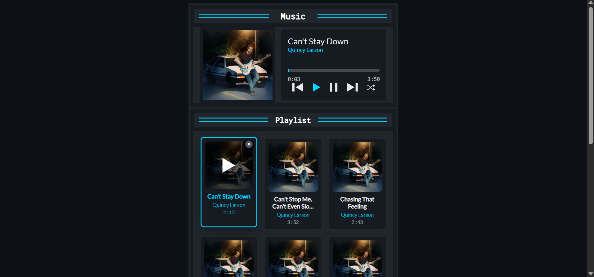

# 🎵 Music Player App

A modern and responsive **Music Player App** built with **HTML**, **CSS**, and **JavaScript**.  
This app allows users to play, pause, skip, shuffle, and manage a playlist with a sleek UI inspired by modern media players.

---

## 🚀 Features
- **Play / Pause / Next / Previous** controls  
- **Shuffle playlist** with random order  
- **Interactive progress bar** with draggable handle for seeking  
- **Playlist management** – delete songs and reset playlist  
- **Responsive design** – works on desktop and mobile  
- **Now playing highlight** for active track  

---

## 🖼️ Screenshots

**Main Player UI**  


---


---

## 📦 Getting Started

### 1️⃣ Clone the repository
```bash
git clone https://github.com/sam-kolige/music-player-app.git 
```
---

### 2️⃣ Open the app

Simply open the index.html file in your browser. No installation required.

---

### 🛠️ Built With

    HTML5 – Structure and layout

    CSS3 – Styling, responsiveness, and animations

    JavaScript (Vanilla) – Core player functionality

---

### 📜 License

This project is open source and available under the MIT License.


